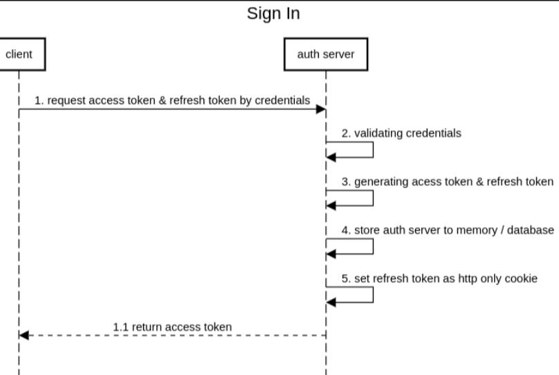
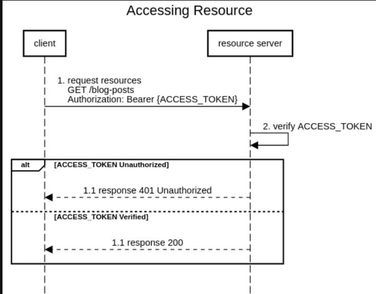

# User Authentication

## Token Based Authentication system (JWT)

## ENDPOINTS

## Sign up

POST /v1/signup -> this endpoint create a user/customer and Generates token

Data sent along with the request:

- firstname
- lastname
- email
- password
- passwordConfirm

- On successful Sign up (Response)
  - 201 status code
  - token
  - user/customer

## Login

POST /v1/login -> this endpoint grant user access and Generates token

Data sent along with the request:

- email
- password

- On successful login (Response)

  - 200 status code
  - token
  - user/customer

- Unsuccessful login (Response)
  - 401 Unauthorized
  - Invalid email or password

## Forget Password

POST /v1/forgetpassword -> this endpoint generate reset token

Data sent along with the request:

- email

- On successful (Response)

  - email
  - reset token

- Unsuccessful login (Response)
  - 400 Bad Request
  - There is no user with the email address

## Reset Password

PATCH /v1/resetpassword/:token -> this endpoint reset the user's password

- On successful (Response)

  - reset token

- Unsuccessful login (Response)
  - 404 Not found
  - Invalid token or token has expired

## Update Password

PATCH /v1/updatepassword -> this endpoint update the user's password

- On successful (Response)

  - email
  - reset token

- Unsuccessful login (Response)
  - 404 Not found
  - You current password was wrong

## Sign in Flow

## Accessing Resources Flow

